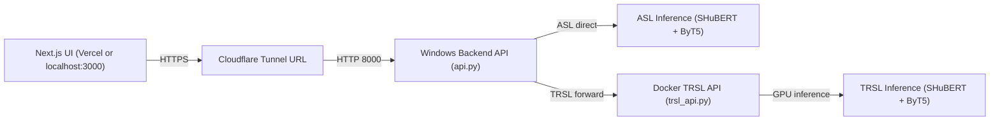

powershell -ExecutionPolicy Bypass -File .\sign-language-ui\start_backend_and_vercel.ps1
powershell -ExecutionPolicy Bypass -File .\sign-language-ui\start_full_stack.ps1


# Tech Stack Notes

This file tracks the current implementation details, libraries, and how to run the full system.
It complements the long-form architecture plan in `README.md`.

## System Diagram



## Request Flow (Sign2Text)

1. UI uploads `video` + `lang` to `/api/translate_video`.
2. `api.py` routes:
   - `ASL` ? runs local ASL inference on Windows.
   - `TRSL` ? forwards to Docker TRSL API on port `8001`.
3. Text result returns to UI and appears in the chat.

## What Is Running Where

- UI (Next.js): `http://localhost:3000` (dev) or Vercel (prod)
- Windows Backend API (ASL + TRSL forwarder): `http://localhost:8000`
- TRSL Docker API (Linux container): `http://localhost:8001`

## Current Services

- UI: Next.js 16, React 19, Tailwind 4
- Backend API: FastAPI + Uvicorn
- ASL inference: SHuBERT + ByT5 (weights in `hf_asl_ckpts_shesterg`)
- TRSL inference: Docker-only (fairseq requirement)

## Key Libraries

- Frontend: `next`, `react`, `tailwindcss`, `framer-motion`, `lucide-react`
- Backend: `fastapi`, `uvicorn`, `python-multipart`, `requests`
- ML/vision: `torch`, `transformers`, `mediapipe`, `opencv`, `decord`, `fairseq`

## Model Weight Paths

- ASL weights: `C:\code_projects\SHuBERT_transferLearning\ASL`
- SHuBERT shared weights (TRSL feature extractors): `C:\code_projects\SHuBERT_transferLearning\SHuBERT_ckpts`
- TRSL weights: `C:\code_projects\SHuBERT_transferLearning\trsl\outputs\trsl_ckpts\checkpoint_ft_w10_unf3_slr1e-05_dlr0.00015_20260316_024301_ep8`

## Health Checks

- Windows backend: `http://localhost:8000/health`
  - Returns `status` plus ASL asset readiness flags.
- TRSL Docker API: `http://localhost:8001/health`
  - Returns `status` plus TRSL asset readiness flags.

## Checkpoint Config (Single Source of Truth)

Edit this file to update checkpoint paths in one place:

`C:\code_projects\SHuBERT_transferLearning\backEnd_API_signlanguage_UI\checkpoints.json`

Example structure:

```json
{
  "asl": { "weights_dir": "ASL" },
  "trsl": {
    "weights_dir": "trsl/outputs/trsl_ckpts/<checkpoint_folder>",
    "shubert_models_dir": "SHuBERT_ckpts",
    "tokenizer_dir": "ASL/byt5_base"
  }
}
```

## Smoke Tests (ASL + TRSL)

```powershell
cd C:\code_projects\SHuBERT_transferLearning\backEnd_API_signlanguage_UI
python run_backend_smoke_tests.py ^
  --asl-video "C:\code_projects\Sign language data\american_sign_language_data\test_data\test1.mp4" ^
  --trsl-video "C:\code_projects\Sign language data\turkish_sign_language data\trsl_test_data\doctor_1772841538.mp4"
```

## One-Click Start (Local)

Run this from `C:\code_projects\Sign_language_UI_SHuBERT\sign-language-ui`:

```powershell
powershell -ExecutionPolicy Bypass -File .\start_full_stack.ps1
```

## Cloudflare Tunnel (Expose Local Backend to Vercel)

Vercel cannot call `localhost:8000` on your machine. You need a public URL that
forwards to your local backend.

### Quick Tunnel (fast, temporary URL)

1. Install `cloudflared` (Windows):

```powershell
winget install --id Cloudflare.cloudflared
```

2. Start the tunnel (standalone):

```powershell
cloudflared tunnel --url http://localhost:8000
```

Or start the backend with the tunnel built in:

```powershell
python api.py --tunnel
```

This prints a `https://<random>.trycloudflare.com` URL. Update Vercel with it:

- Vercel Project ? Settings ? Environment Variables
- `NEXT_PUBLIC_API_URL = https://<random>.trycloudflare.com`
- Redeploy

Quick tunnels are temporary and the URL changes each time.

### Named Tunnel (stable URL)

For a stable URL, create a named tunnel and map a domain/subdomain you own in
Cloudflare. This requires a Cloudflare account and a domain on Cloudflare.

High-level steps:

1. Create a tunnel in the Cloudflare dashboard.
2. Add a route (hostname ? `http://localhost:8000`).
3. Run the tunnel on your machine using the provided token.

## Environment Variables

- `NEXT_PUBLIC_API_URL` (UI): points to backend API URL
- `ASL_WEIGHTS_DIR` (Backend): override ASL weights folder
- `TRSL_WEIGHTS_DIR` (Backend/Docker): override TRSL weights folder
- `TRSL_API_URL` (Backend): points to Docker TRSL API (`http://localhost:8001`)

## Backend Entry Points

- Windows backend: `C:\code_projects\SHuBERT_transferLearning\backEnd_API_signlanguage_UI\api.py`
- TRSL Docker backend: `C:\code_projects\SHuBERT_transferLearning\backEnd_API_signlanguage_UI\trsl_api.py`
